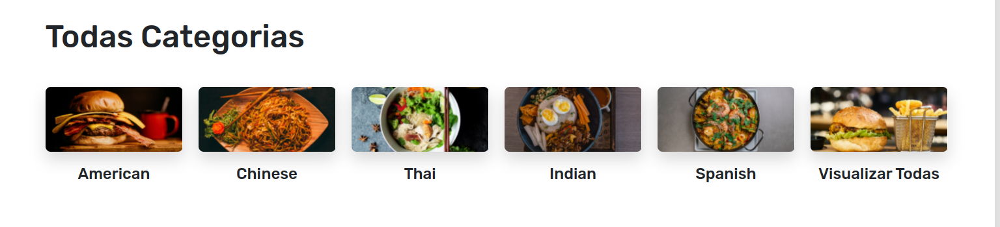
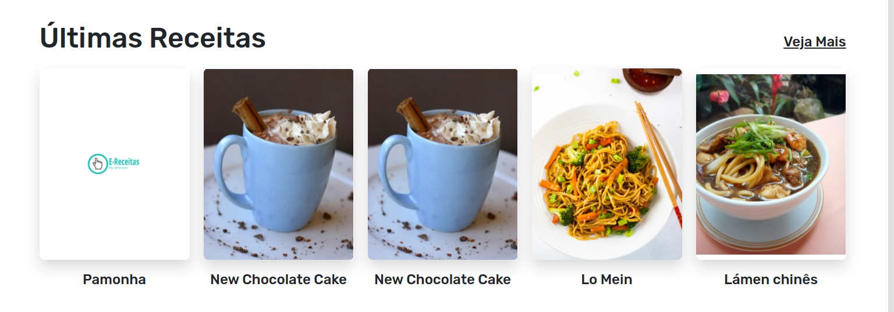
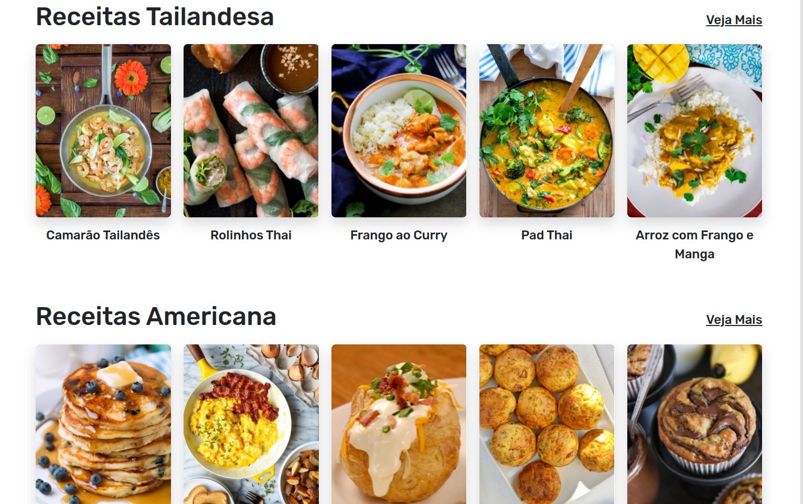
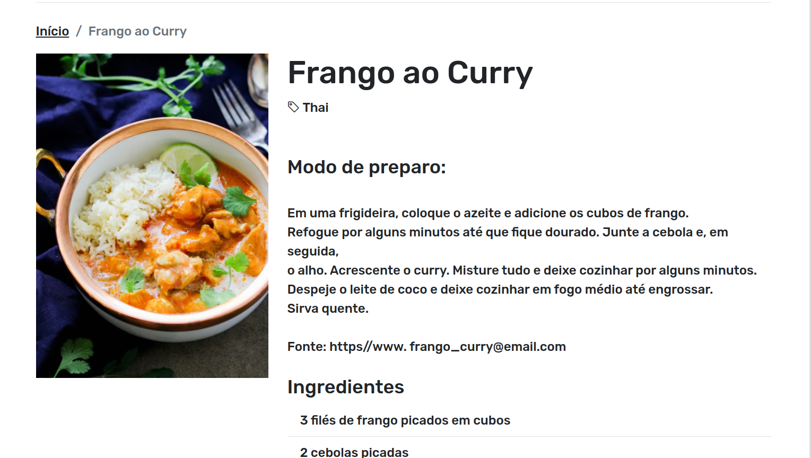

<h1 align="center">
  
</h1>
 
 <h1 align="center"> 
   Recipes Blog
  </h1>

<h4 align="center"> 
	🚧  Recipes Blog 🚀 Concluded  🚧
</h4>
 
E-Recipes is a simple blog, intuitive blog where our readers can search for a particular recipe, search by recipe category, post a recipe and contact us by sending a message. 
 
## Tecnology
 
Here are the technologies used in this project.
 
* [CSS](https://developer.mozilla.org/pt-BR/docs/Web/CSS)
* [HTML](https://developer.mozilla.org/pt-BR/docs/Web/HTML)
* [JavaScript](https://developer.mozilla.org/pt-BR/docs/Web/JavaScript)
* [Node.js](https://nodejs.org/en/)
* [Bootstrap](https://getbootstrap.com/) 
* [Mongodb](https://www.mongodb.com/)
* [EJS](https://ejs.co/)
* [Express](https://expressjs.com/)
* [Connect-flash](https://www.npmjs.com/package/connect-flash)
* [Cookie-parser](https://www.npmjs.com/package/cookie-parser)
 
 
## Services Used.
 
* Github
* Netlify

## Get starting.
### 1 - Home. On the home page you can navigate through the menu by clicking on the names *Home, About, Send or Contact* that you will be directed to. On the side there is a field *Search* where you can search for specific recipes. 


### 2 - All Categories. Clicking on one of these will take you to all the recipes in that category.


### 3 - Latest Recipes. Here are the recipes that were posted recently.


### 4 - Recipes by Category. In this section the recipes are presented by category with the cards of their respective recipes.

 
 ### 5 - Clicking on Recipe. When you click on a recipe from a respective category, you will see all the recipe ingredients and preparation method.
 
 
 ### 6 - Publish a Recipe. Here you have the option to post a recipe by clicking on the *Post Recipes* button, a page with a form to fill out and post your recipe.
 
 
## Running this project on your machine.
 
Before starting, you will need to have the following tools installed on your machine:
[Git](https://git-scm.com), [Node.js](https://nodejs.org/en/). 
Besides, it's good to have an editor to work with the code like [VSCode](https://code.visualstudio.com/)

```bash
# Clone this repository
$ git clone <https://github.com/Jefersoncf/project-blog-recipe-nodeJS>

# Access the project folder through terminal/cmd
$ cd project-blog-recipe-nodeJS

# Install the dependencies
$ npm install

# Run the application
$ npm run start

# The server will start on port:3000 - access <http://localhost:3000>
```
 
## Features
 
  - [x] To look for
  - [x] Search by category
  - [x] Post recipes
  - [x] Show recent recipe
  - [x] Show random recipes
  - [x] Send an email with questions or suggestions
 
 
## Links
 
  - Link of deployed application: (if has been deployed)
  - Repository: https://github.com/Jefersoncf/project-blog-recipe-nodeJS
    - In case of sensitive bugs like security vulnerabilities, please contact
      YOUR EMAIL directly instead of using issue tracker. We value your effort
      to improve the security and privacy of this project!
 
 
## Versioning
 
1.0.0.0
 
 
## Authors
 
* **Jeferson Ferreira**: @Jefersoncf (https://github.com/Jefersoncf)
 
 
Please follow github and join us!
Thanks to visiting me and good coding!

## License

This project is under license [MIT](https://github.com/Jefersoncf/project-blog-recipe-nodeJS/blob/main/LICENSE)

Made by Jeferson Ferreira [contact](www.linkedin.com/in/jeferson-ferreirajf23)
